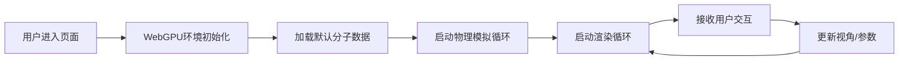

## 1. 产品概述

基于WebGPU的分子动力学3D可视化系统，用于实时展示分子结构、原子间作用力和分子运动轨迹。系统支持鼠标/触屏交互，可通过时间轴控制分子运动的播放、暂停和速度调节。面向科研人员、学生和化学爱好者，提供直观的分子动力学模拟可视化体验。

## 2. 核心功能

### 2.1 用户角色
| 角色 | 注册方式 | 核心权限 |
|------|----------|----------|
| 访客用户 | 无需注册 | 浏览分子模型、交互操作、调整参数 |

### 2.2 功能模块
1. **3D分子渲染模块**：基于WebGPU的高性能实时渲染，支持原子球体、化学键、作用力线的绘制
2. **物理引擎模块**：分子动力学模拟，包含原子运动、碰撞检测、作用力计算
3. **交互控制模块**：鼠标/触屏旋转视角、缩放、平移操作
4. **时间轴控制模块**：播放/暂停、速度调节、进度控制
5. **数据解析模块**：支持多种分子数据格式的解析与加载

### 2.3 页面详情
| 页面名称 | 模块名称 | 功能描述 |
|---------|----------|----------|
| 主页面 | 3D画布 | 全屏WebGPU渲染画布，实时展示分子运动 |
| 主页面 | 控制面板 | 分子选择、播放控制、速度调节、显示选项 |
| 主页面 | 信息面板 | 显示当前分子信息、原子数量、模拟时间等 |

## 3. 核心流程

用户进入页面 → 系统初始化WebGPU环境 → 加载默认分子模型 → 启动物理模拟与渲染循环 → 用户通过鼠标交互旋转/缩放视角 → 通过控制面板切换分子、调整播放速度 → 实时观察分子运动和作用力变化

## 4. 用户界面设计

### 4.1 设计风格
- **主色调**：深空蓝 (#0a1628) 作为背景，营造科研氛围
- **辅助色**：青色 (#00d4ff) 用于高亮和交互元素
- **点缀色**：霓虹粉 (#ff00aa) 用于特殊状态和强调
- **按钮风格**：玻璃拟态 (Glassmorphism)，半透明背景 + 模糊效果
- **字体**：现代无衬线字体，代码风格的数字显示
- **布局风格**：沉浸式全屏3D画布，悬浮式控制面板
- **图标风格**：线性简约图标，科技感

### 4.2 页面设计概述
| 页面名称 | 模块名称 | UI元素 |
|---------|----------|--------|
| 主页面 | 3D画布 | 全屏WebGPU渲染，深黑色背景，发光分子效果 |
| 主页面 | 控制面板 | 左侧悬浮面板，玻璃拟态风格，包含分子选择器、播放控制、参数滑块 |
| 主页面 | 信息面板 | 右上角信息卡片，显示统计数据 |
| 主页面 | 时间轴 | 底部时间轴控制条，带播放/暂停按钮和进度指示 |

### 4.3 响应式
- 桌面端优先设计，支持全屏沉浸式体验
- 适配平板和移动设备，触屏手势支持
- 控制面板在小屏幕上可折叠收起

### 4.4 3D场景指导
- **环境**：深空背景，轻微星点粒子效果
- **光照**：多光源设置，环境光 + 方向光 + 点光源，营造立体感
- **相机**：透视相机，可环绕观察，支持自动旋转
- **组成**：分子位于场景中心，留有充足观察空间
- **交互**：鼠标拖拽旋转、滚轮缩放、右键平移
- **后处理**：辉光 (Bloom) 效果，增强科技感
- **性能**：目标60fps，支持上百个原子的实时模拟
