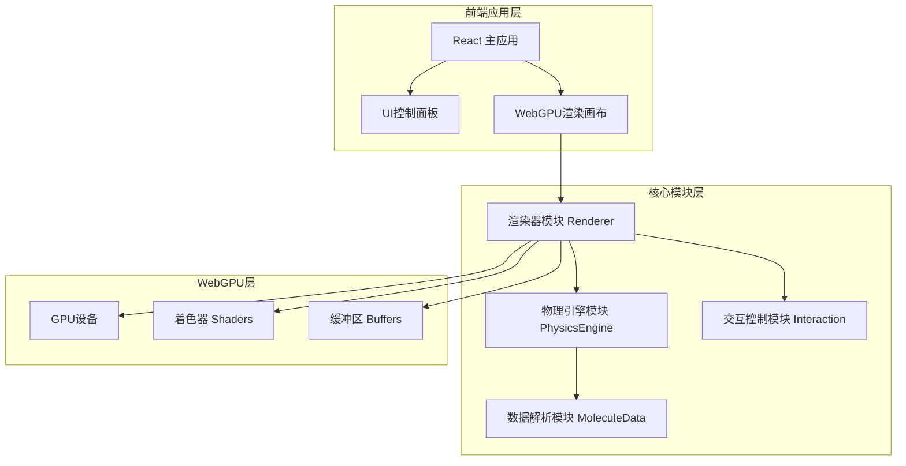

## 1. 架构设计



## 2. 技术描述

- **前端框架**: React@18 + TypeScript + Vite
- **样式方案**: TailwindCSS@3
- **状态管理**: Zustand
- **3D渲染**: 原生 WebGPU API (无需Three.js)
- **图标库**: lucide-react
- **物理模拟**: 自研分子动力学引擎 (简化版Lennard-Jones势)

## 3. 模块定义

### 3.1 核心模块

| 模块名称 | 文件路径 | 功能描述 |
|---------|----------|----------|
| 渲染器 | `src/core/WebGPURenderer.ts` | WebGPU渲染管线管理，原子、化学键、作用力线的绘制 |
| 物理引擎 | `src/core/PhysicsEngine.ts` | 分子动力学模拟，速度、位置更新，作用力计算 |
| 交互控制 | `src/core/InteractionController.ts` | 鼠标/触屏事件处理，视角旋转、缩放、平移 |
| 数据解析 | `src/core/MoleculeData.ts` | 分子数据结构定义，内置分子模型，数据解析 |

### 3.2 组件模块

| 组件名称 | 文件路径 | 功能描述 |
|---------|----------|----------|
| 主应用 | `src/App.tsx` | 应用入口，整合所有模块 |
| 控制面板 | `src/components/ControlPanel.tsx` | 分子选择、播放控制、参数调节 |
| 信息面板 | `src/components/InfoPanel.tsx` | 显示模拟统计信息 |
| 时间轴 | `src/components/Timeline.tsx` | 播放进度控制 |
| WebGPU画布 | `src/components/WebGPUCanvas.tsx` | Canvas封装，WebGPU初始化 |

### 3.3 状态管理

| Store名称 | 文件路径 | 功能描述 |
|-----------|----------|----------|
| 模拟状态 | `src/store/simulationStore.ts` | 播放状态、速度、当前分子、显示选项 |

## 4. 数据模型

### 4.1 原子数据结构

```typescript
interface Atom {
  id: number;
  element: string;
  position: { x: number; y: number; z: number };
  velocity: { x: number; y: number; z: number };
  color: { r: number; g: number; b: number };
  radius: number;
  mass: number;
}
```

### 4.2 化学键数据结构

```typescript
interface Bond {
  atom1: number;
  atom2: number;
  type: 'single' | 'double' | 'triple';
}
```

### 4.3 分子数据结构

```typescript
interface Molecule {
  name: string;
  formula: string;
  atoms: Atom[];
  bonds: Bond[];
}
```

### 4.4 相机数据结构

```typescript
interface Camera {
  position: { x: number; y: number; z: number };
  target: { x: number; y: number; z: number };
  up: { x: number; y: number; z: number };
  fov: number;
  near: number;
  far: number;
}
```

## 5. 渲染管线

### 5.1 原子渲染管线
- 顶点缓冲区：球体网格顶点
- 实例缓冲区：原子位置、颜色、半径
- 顶点着色器：模型视图投影变换
- 片段着色器：Phong光照模型 + 发光效果

### 5.2 化学键渲染管线
- 圆柱体或线条渲染
- 实例化绘制

### 5.3 作用力线渲染管线
- 线条渲染，动态更新
- 颜色表示力的大小和方向

## 6. 物理模拟算法

- **Lennard-Jones势**：计算原子间相互作用力
- **Verlet积分**：位置和速度更新
- **边界条件**：周期性边界或弹性碰撞
- **能量守恒**：可选的恒温器控制
